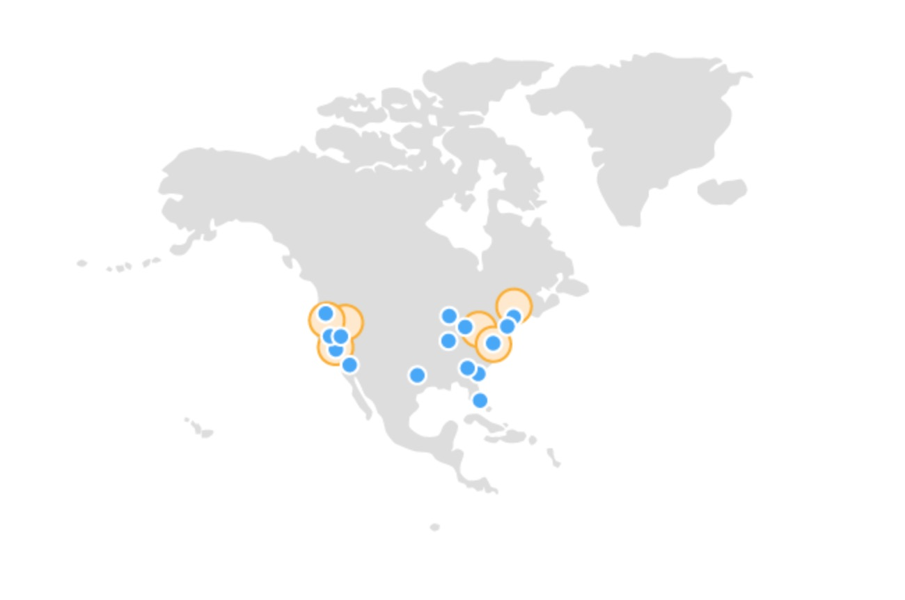
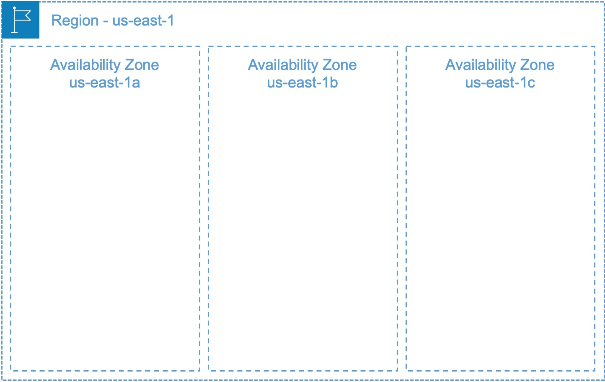

# Brief AWS Overview
# Regions & Availability Zones

---

<!-- paginate: true -->

## History
- Early 2000, Amazon was expanding its B2B
- Standardized around early Agile, CICD, RESTful practices
- 2006, Amazon's S3 and EC2 launched
- Shortly after, several other products shipped: DynamoDB, CloudFront, RDS, etc
- Some that no longer exist (e.g. SimpleDB) 

---
 
 <!-- move this to the left only on this slide --> 
 <!-- _footer: "[Amazon Regions](https://aws.amazon.com/about-aws/global-infrastructure/regions_az/)" -->

# Regions
- Regions are logical groupings of physical close but isolated data centers
- Regions contain 3 or more Availability Zones (AZs)
- Original region is Northern Virginia (us-west-2) in Arlington

--- 
 <!-- move this to the left only on this slide --> 

## Availability Zones (AZs)
- Each region 3+ AZs
- Each AZ is a cluster of DC buildings
- Locations unknown but considered 'fault tolerant' b/w other AZs
- Interconnects are fiber and redundant

---

<!-- _footer: "1. https://docs.aws.amazon.com/govcloud-us/latest/UserGuide/getting-started-sign-up.html -->

## Non-Standard Regions
### AWS GovCloud (US-East, US-West)

Requires US entity that is incorporated.  Individual must be a US citizen or green card holder.  Must be able to handle International Traffic and Arms Regulation (ITAR) export controlled data[1][1].

### AWS China (Beijing, Ningxia) 
Operated by another provider.  Requires dedicated account.

[1]: https://docs.aws.amazon.com/govcloud-us/latest/UserGuide/getting-started-sign-up.html

