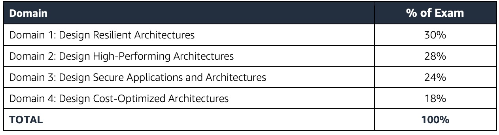

# AWS Well Architected Framework
## [Reliability Pillar](https://docs.aws.amazon.com/wellarchitected/latest/reliability-pillar/welcome.html)

---

<!-- move this to the left only on this slide --> 
## Exam Content for Reliability
- Plan for fault tolerance
- Know scaling patterns (horizontal v. vertical)
- Decoupled design patterns
- Data availability & durability

---

## AWS Exam Brochure

Review the [exam brochure, page 3.](https://d1.awsstatic.com/training-and-certification/docs-sa-assoc/AWS-Certified-Solutions-Architect-Associate_Exam-Guide.pdf)
