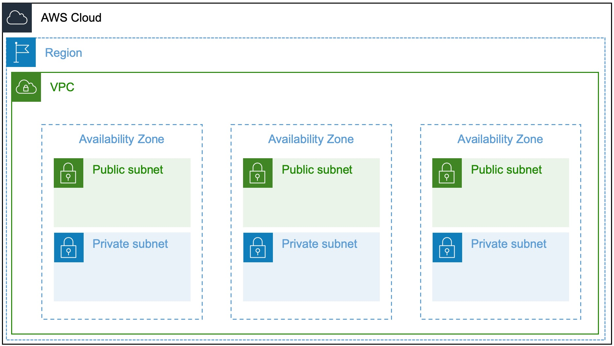

# VPC, Subnets, Gateways
# Hybrid Implementation

---

## Virtual Private Cloud (VPC)
[AWS Docs](https://docs.aws.amazon.com/vpc/latest/userguide/VPC_Subnets.html)

- Within a single region
- Not tied to availability zone
- Suggested to use RFC-1918 ([ref](https://datatracker.ietf.org/doc/html/rfc1918#section-3))
- DHCP options set here (DNS, ntp, dns suffix)
- Some size limitations ([details](https://docs.aws.amazon.com/vpc/latest/userguide/VPC_Subnets.html#VPC_Sizing))

---

<!-- move this to the left only on this slide --> 

## Subnets
- Bound within a single AZ
- Cannot overlap
- One route table/subnet
- One NACL/subnet

---

## Internet Gateway (IGW)
- Created per-region, then attached to a VPC
- Horizontally scaled & HA under the hood
- "Unlimited bandwidth" per spec
- NAT for inbound access to instances w/ public IPs
- Egress point for route tables to internet

---

## Egress-Only Internet Gateway (EIGW)
- Identical to IG except...
- **IPv6 only**.  Use NAT gateway for IPv4
- Only allows outbound traffic
- Will not NAT internet traffic into VPC

---

## Side Note: AWS Global Network

Q. Does traffic go over the internet when two instances communicate using public IP addresses, or when instances communicate with a public AWS service endpoint?

No. When using public IP addresses, all communication between instances and services hosted in AWS use AWS's private network. Packets that originate from the AWS network with a destination on the AWS network stay on the AWS global network, except traffic to or from AWS China Regions.

---

## NAT Gateways vs. Instances

- NAT instance is legacy & not HA; [know it exists](https://docs.aws.amazon.com/vpc/latest/userguide/vpc-nat-comparison.html)

---

## NAT Gateway
- Highly available; scales horizontally to 45 Gbps
- Fully managed; failover is automatic
- Build 1 in each AZ for AZ-based redundancy
- No types or sizes to pick; nothing to log into

---

## VPC Endpoints & PrivateLink

---

## VPC Peering, Direct Connect & Similar

--- 

## VPC Reserved Resources
For subnet `10.0.0.0/24`:
- `10.0.0.0`: Network address.
- `10.0.0.1`: Reserved by AWS for the VPC router.
- `10.0.0.2`: Reserved by AWS. The IP address of the DNS server is the base of the VPC network range plus two. For VPCs with multiple CIDR blocks, the IP address of the DNS server is located in the primary CIDR. We also reserve the base of each subnet range plus two for all CIDR blocks in the VPC. For more information, see Amazon DNS server.

<!-- _footer: "https://docs.aws.amazon.com/vpc/latest/userguide/VPC_Subnets.html#VPC_Sizing" -->

---

## VPC Reserved Resources (Cont.)

`10.0.0.3`: Reserved by AWS for future use.

10.0.0.255: Network broadcast address. We do not support broadcast in a VPC, therefore we reserve this address.

<!-- _footer: "https://docs.aws.amazon.com/vpc/latest/userguide/VPC_Subnets.html#VPC_Sizing" -->